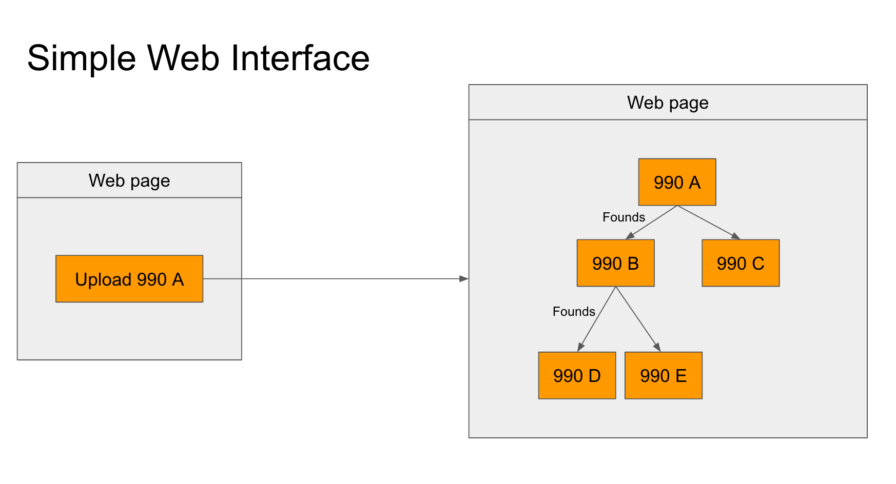
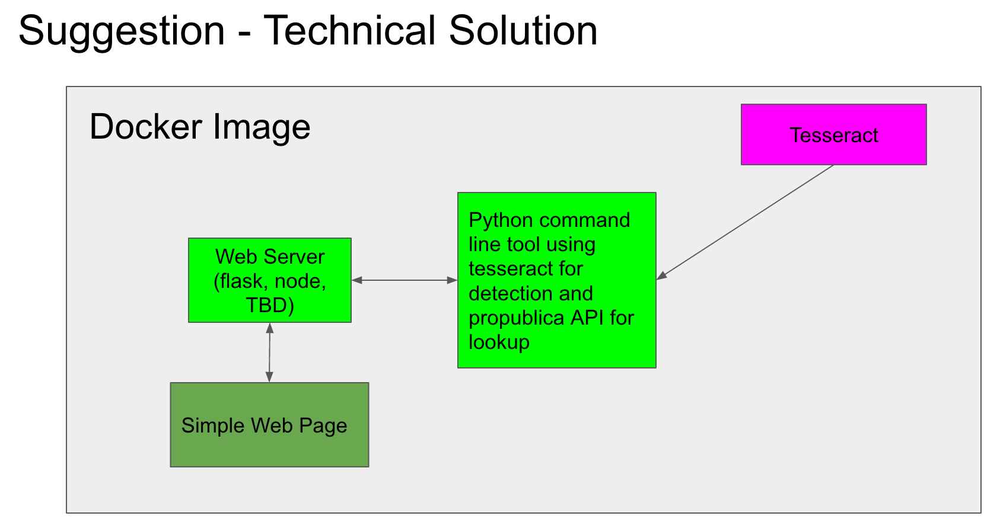

# Hacks/Hackers Following the 990 Money

Welcome to LA's Hacks&Hackers chapter. We're working on a pilot project to relaunch our group. We've chosen to tackle one aspect of a group of federal tax filings known as "990s". Most nonprofit organizations are required to file these as annual returns every year, and they contain important information about each group, including address, key employees, mission, financials, as well as some information about the flow of money from donors and between nonprofits.

## What's missing

Despite what they do contain, 990s are notorious for the information they leave out. We are focusing on one element of missing information, specifically, who a nonprofit receives funding FROM. This is crucial information, as lots of nonprofits are used as pass-through entities by people who want to conceal the real motives for funding—especially in the realm of politics.

## What we will try to do

We will try to automate the process of collecting all available 990s, and then scrape information from each of them, including data on who they give money TO. By building a central, searchable database and creating unique identifiers, we hope to be able to create a tool that could tell anyone—a citizen, a reporter, a regulator—who a nonprofit gets its dollars from. 

## Why are we doing this?

This question is often a mystery at the moment. Some nonprofits voluntarily disclose the sources of their funding, but often they do not. If we can fill this gap in available information, we will be making a significant contribution towards transparency of our political system.

## Phase 1 interface

## Suggested technical solution (very brief)

